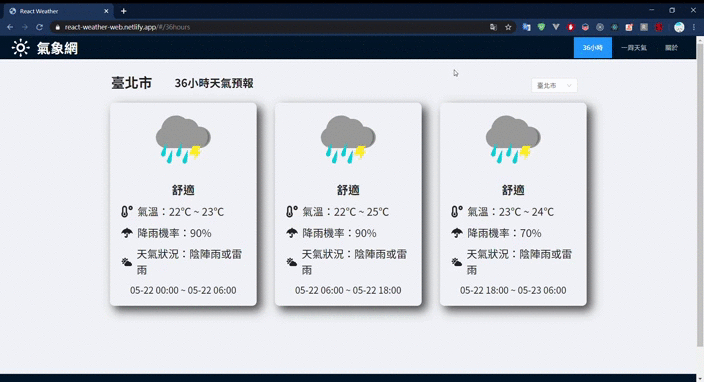
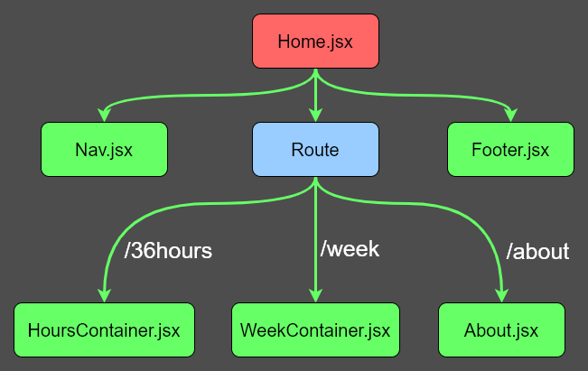

## 台灣天氣查詢網頁

[作品網址](https://react-weather-web.netlify.com/)


---

## Demo



---

### 特點

- 自製 Slider 組件
- 自行撰寫 webpack 設定檔

---

### 專案組件結構圖([詳細連結](https://github.com/FizzyElt/ReactWeatherWeb/blob/master/Structure.md))



---

### 使用框架及套件

- React
- Ant Design
- axios
- react-icons
- react-router
- react-transition-group

## 使用步驟

### 下載套件

終端機執行

```
npm install
```

要正常使用請先到[氣象局資料開放平台](https://opendata.cwb.gov.tw/index)申請 Token

在 src 資料夾內新增 apiToken.js 檔案撰寫以下內容

```js
export const Token = '<your Token>'
```

### 運行

```
npm run start
```

網址 127.0.0.1:3000

### 打包

```
npm run build
```
